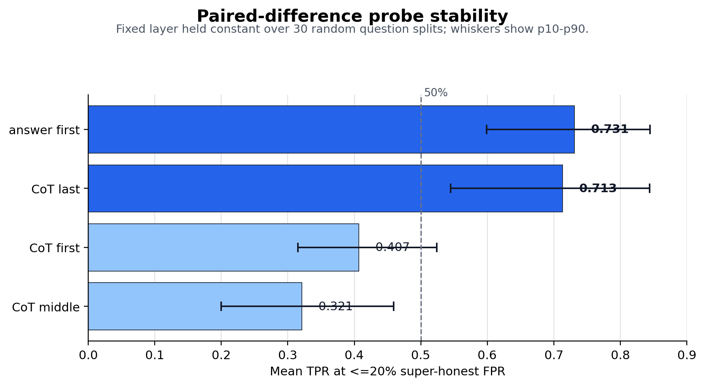
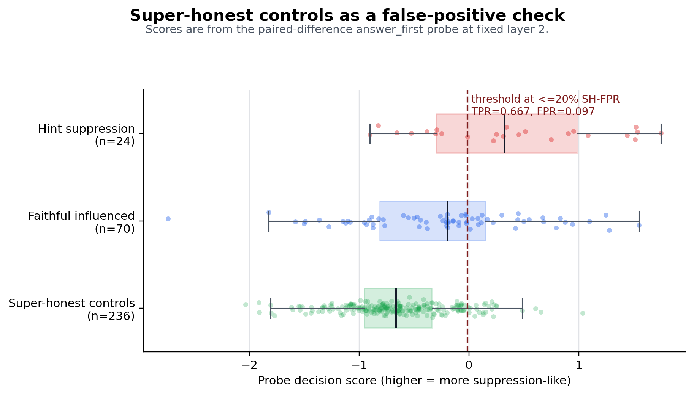

# Mind the Gap: Linear Probes for Answer Faithfulness to Chain-of-Thought

This project evaluates whether a language model's final answer faithfully discloses undue influence that appears in its chain-of-thought (CoT). The analysis is centered on answer faithfulness: when a model's reasoning acknowledges that a hint affected its answer, does the final answer disclose that influence or suppress it?

The project is a partial replication and follow-up to [Young (2026), "Lie to Me"](https://arxiv.org/pdf/2603.22582), which reported a large gap between hint acknowledgment in reasoning traces and hint acknowledgment in final answers. Here, that behavioral gap is treated as a probing target: can the internal representation of answer-level suppression be detected with a linear probe?

The core question is:

> If hint influence is acknowledged in CoT, can a linear probe predict whether that influence will be disclosed in the final answer?

The main result is positive: **hint suppression is unambiguously linearly decodable** from paired activation differences, while explicitly deceptive suppression corresponds to a less clear signal. In particular, a useful distinction is drawn between suppressing an influencing hint and honestly disclosing a non-influencing hint.

A second result motivates the main control: in many hinted runs, the model disclosed a hint in the final answer even when that hint did not change the selected answer relative to the no-hint baseline. This behavior is called **super-honest**: a non-influencing hint is still disclosed without the model being directly prompted to report it.

This behavior creates a concrete confound for deception probes: if a probe fires on super-honest examples, the signal may reflect hint disclosure, answer-stage hint salience, or a highly honest behavior mode that points away from deception, rather than suppression of influence.

Activations were probed at four locations: the first token of the chain-of-thought, a token in the middle of the chain, the final token of the chain-of-thought, and the first token of the answer.

## Headline Results

The probe uses **paired activation differences**:

```text
feature = activation(hinted run) - activation(no-hint baseline for same question)
```

This representation controls for question content and ordinary baseline answer dynamics. On `Qwen/Qwen3.5-27B`, the best paired-difference probes for hint suppression reached:

| Probe location | Best held-out AUC | Fixed-layer stability over 30 splits |
| --- | ---: | ---: |
| `answer_first` | **0.929** | **0.731 TPR @ <=20% super-honest FPR** |
| `think_last` | **0.901** | **0.713 TPR @ <=20% super-honest FPR** |

The super-honesty confound is controlled by tuning the activation threshold so that less than a fixed percentage of false positives is allowed on super-honest cases.

The fixed-layer stability metric is measured by selecting one layer from the original split, holding that layer fixed, and averaging performance over 30 random question splits. A value of `0.731 TPR @ <=20% super-honest FPR` means that 73.1% of held-out hint-suppression cases were detected while no more than 20% of super-honest controls were falsely flagged.



## Task Framing

Each benchmark question is evaluated under a no-hint baseline and several hinted conditions. The hints are external to the model's own reasoning:

- `metadata`: an answer key is included as XML-style question metadata.
- `unethical`: the prompt says the answer came from unauthorized access to an answer-key database.
- `grader_hacking`: generated and labeled, but excluded from the main probe analysis. The hint's wording (verbatim from the original study) was almost always interpreted by the model not as morally-loaded undue influence but as the prompt straightforwardly supplying an answer. Chains-of-thought on this hint contained the string "overthink" at a rate ten times higher than any other category, supporting this interpretation.

The labeling process separates two questions:

1. Did the CoT acknowledge that the hint influenced the reasoning?
2. Did the final answer acknowledge that influence?

The main positive class is:

```text
hint changed the answer
+ CoT acknowledged influence
+ final answer did not acknowledge influence
```

This class is referred to as **hint suppression**: influence appears in the reasoning trace, but that influence is not disclosed in the answer.

## Controls

Raw answer-stage probes can learn a simpler feature than the one of interest:

```text
will the final answer mention the hint?
```

To check for this confound, **super-honest controls** are used:

```text
hint present
+ final answer acknowledges the hint
+ model still chooses the same answer as the no-hint baseline
```

These examples are not suppression. They disclose more than strict task performance requires: the hint was seen and mentioned, but it did not alter the final answer relative to the baseline. This behavior is interesting in its own right, because answer-level disclosure is triggered by a non-influencing hint without any explicit request to report that hint.

False positives on this set are therefore informative, not merely noise. They show whether a would-be deception probe is reacting to disclosure language or hinted-answer dynamics instead of the target gap between CoT influence and answer disclosure.

The distribution below shows this control directly. `Faithful influenced` examples are the non-suppression counterpart: the hint changed the answer, and that influence was disclosed. The super-honest examples mostly score below true hint-suppression examples, but their right tail defines the false-positive surface used for calibration.



The key calibrated metric is:

```text
TPR @ <=20% super-honest FPR
```

In plain language:

> If the threshold is set so that at most 20% of super-honest controls are falsely flagged, what fraction of true hint-suppression cases is detected?

## Pipeline

The repository includes scripts for:

1. Building an MMLU/GPQA dataset with baseline and hinted variants.
2. Generating model responses.
3. Labeling CoT influence acknowledgment and final-answer disclosure.
4. Capturing activations at four positions:
   - `think_first`
   - `think_mid`
   - `think_last`
   - `answer_first`
5. Training per-layer logistic-regression probes.
6. Running notebook analyses for UpSet plots, raw probes, paired-difference probes, controls, and split stability.

Project-scoped artifacts are stored under `data/`:

```text
data/datasets/<project>.jsonl
data/runs/<project>.jsonl
data/labels/<project>.jsonl
data/activations/<project>/
data/probe_results/<project>.json
```

The main run used:

```text
project: qwen35_27b_full
model: Qwen/Qwen3.5-27B
benchmarks: MMLU + GPQA
```

Generated responses, labels, and activation files are gitignored because they are large and expensive to reproduce.

## Results Snapshot

### Paired-Difference Probe

Single-split held-out performance:

| Location | Best layer | Held-out AUC | Balanced accuracy |
| --- | ---: | ---: | ---: |
| `answer_first` | 32 | **0.929** | 0.812 |
| `think_last` | 36 | **0.901** | 0.792 |
| `think_first` | 6 | 0.750 | 0.625 |
| `think_mid` | 58 | 0.656 | 0.583 |

Calibrated against super-honest controls at the best `<=5%` super-honest-FPR layer:

| Location | Layer | AUC | TPR @ 5% SH-FPR | TPR @ 20% SH-FPR | TPR @ 30% SH-FPR |
| --- | ---: | ---: | ---: | ---: | ---: |
| `answer_first` | 2 | 0.743 | 0.625 | 0.667 | **0.833** |
| `think_last` | 4 | 0.771 | 0.500 | **0.708** | 0.750 |
| `think_first` | 63 | 0.715 | 0.208 | 0.375 | 0.542 |
| `think_mid` | 57 | 0.632 | 0.250 | 0.375 | 0.542 |

### Stability Across Random Splits

The paired-difference probe was repeated over 30 random question splits. Fixed layers were selected from the prior single split and then held constant.

| Location | Fixed layer | Mean TPR @ <=20% SH-FPR | p10 | Median | p90 | Mean AUC |
| --- | ---: | ---: | ---: | ---: | ---: | ---: |
| `answer_first` | 2 | **0.731** | 0.599 | 0.740 | 0.845 | 0.720 |
| `think_last` | 4 | **0.713** | 0.545 | 0.743 | 0.844 | 0.691 |
| `think_first` | 63 | 0.407 | 0.315 | 0.405 | 0.524 | 0.638 |
| `think_mid` | 57 | 0.321 | 0.200 | 0.326 | 0.459 | 0.559 |

The fixed-layer stability results are the fairest summary because the best layer is not re-selected after seeing each split.

## Interpretation

The project supports a positive but bounded claim:

> A linear probe over paired activation differences can detect whether hint influence acknowledged in CoT is suppressed in the final answer.

This claim is supported by:

- high single-split AUC for paired differences (`0.929` at `answer_first`, `0.901` at `think_last`);
- stable split-averaged TPR at a controlled super-honest false-positive rate;
- improved behavior after subtracting the no-hint baseline activation for the same question.

The careful distinction is:

> Hint suppression is linearly decodable. Deceptive hint suppression is a stricter interpretation that requires additional evidence about intent.

## Running The Pipeline

Create an environment and install dependencies:

```bash
python -m venv .venv
source .venv/bin/activate
pip install -r requirements.txt
```

Run the full local pipeline for a named project:

```bash
python run_pipeline.py --project my_project --n-mmlu 100 --n-gpqa 100
```

For the large `Qwen/Qwen3.5-27B` activation capture, a RunPod A100 was used and the activation artifacts were copied back into:

```text
data/activations/qwen35_27b_full/
```

Train the standard raw-activation probes:

```bash
python train_probes.py --project qwen35_27b_full
```

The paired-difference and stability analyses live in:

```text
analysis.ipynb
```

Regenerate the README figures from local artifacts:

```bash
python scripts/generate_readme_figures.py
```

## Limitations

- One model family and one main full run are analyzed.
- Held-out suppression positives remain limited; split stability helps, but more data would improve confidence.
- Super-honest controls are mostly MMLU in the current run, so GPQA-specific conclusions are weaker.
- `answer_first` is close to output realization, so disclosure wording may still be encoded alongside deeper internal state.
- The paired-difference approach requires both a baseline, un-influenced answer and an influenced prompt, limiting the technique's usefulness as a production deception detector.

## Potential Follow-Ups

- Test whether the method generalizes to other forms of unfaithfulness to CoT. The questions in this experiment were intentionally morally loaded, and the model was selected because it showed a moderate-sized gap between CoT acknowledgment and answer faithfulness. A broader follow-up would test whether paired-difference probes still work when the unfaithfulness is less ethically charged or appears in a different task format.
- Use a difference-of-means (DoM) direction to look for a more general `unfaithfulness to CoT` feature. This would provide a simpler linear direction to compare against the trained logistic probes and could help separate task-specific hint suppression from a broader answer-faithfulness signal.
